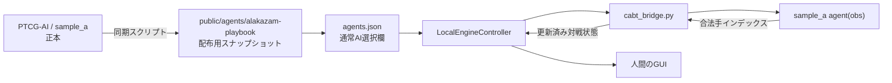

# 現行フーディンAI対戦席 設計

## 目的

共有URLとローカルGUIの通常AI選択欄へ「フーディンAI（現行sample_a）」を追加する。人間がこのAIを対戦相手として選ぶと、正規のフーディン60枚デッキが自動設定され、相手ターンを `C:\dev\PTCG-AI\src\agent\sample_a` の現行ルールベースが自動操作する。

## 採用方式

`sample_a` の実行時ファイルだけをCABT Viewerの公開エージェント領域へ同期し、既存のバンドルAIと同じ経路で読み込む。

- 表示名: `フーディンAI（現行sample_a）`
- エージェントID: `alakazam-playbook`
- GUI上の操作方式: 通常の `AI`
- デッキ: `sample_a/deck.csv` と固定し、GUIでAIを選んだ時に自動設定する
- AI操作: CABT Pythonブリッジが `main.py` の `agent(obs_dict)` を呼び、相手ターンを自動進行する
- 対応範囲: ローカル版と共有URL版

既存のCodex操作席は使わない。アップロードAIとして登録する方式も使わない。

## 構成

## 同期境界

正本は `C:\dev\PTCG-AI\src\agent\sample_a` とする。CABT Viewerへ含めるのは次の実行時ファイルだけとする。

- `main.py`
- `cards.py`
- `catalog.py`
- `memory.py`
- `model.py`
- `policy.py`
- `proposals.py`
- `rule_manifest.py`
- `strategy_config.py`
- `deck.csv`
- `rules/__init__.py` と `rules/*.py`

`tests/`、`artifacts/`、`evaluate.py`、`opponent_decks.py`、`cg/`、`__pycache__/`、対戦ログは同期しない。CABTのネイティブファイルは従来どおり `CABT_SAMPLE_SUBMISSION_DIR` から供給し、リポジトリへ追加しない。

同期スクリプトは既定でCABT Viewerから `../../PTCG-AI/src/agent/sample_a` を参照し、必要なら環境変数 `CABT_SAMPLE_A_SOURCE_DIR` で正本パスを上書きできるようにする。正本または必須ファイルが見つからない場合は途中成果を配布せず、対象パスを示して失敗する。同期後に `deck.csv` が60枚であることも検証する。

共有URLの更新スクリプトは配布物を組み立てる前に同期を実行する。これにより、今後 `sample_a` を改善して共有版を更新する時も、古いAIスナップショットを配布しない。

## GUIの挙動

既存のAI選択UIとデッキ連動機能をそのまま利用する。

1. プレイヤー2の操作方式で `AI` を選ぶ。
2. AI一覧から `フーディンAI（現行sample_a）` を選ぶ。
3. プレイヤー2のデッキ欄へ専用60枚デッキが自動設定され、AIとデッキの組み合わせを変更できない状態になる。
4. 人間のデッキを選び、対戦開始を押す。
5. 人間の選択だけGUIで受け付け、AIの選択は既存の自動進行経路で処理する。

対戦画面のレイアウト、カード効果、オーバーレイ、手札表示、ログ表示、Codex操作席、通信対戦には変更を加えない。

## 状態と分離

`sample_a/main.py` の `AgentSession` は1対戦中だけ状態を保持する。CABT Viewerは対戦開始時にPythonブリッジを再起動する既存仕様を維持するため、前の対戦の予約攻撃役や既知情報は次の対戦へ持ち越されない。

Viewer側ではAIの判断規則を再実装しない。GUI固有の補正も追加せず、同期された `sample_a` が返した合法手インデックスだけを既存ブリッジへ渡す。これにより、自己対戦で検証したAIとGUI上のAIを同一実装に保つ。

## エラー処理

- 同期元不足: 同期・デプロイを明示的に失敗させ、不完全なAIを配布しない。
- 60枚不一致: 同期時に失敗させる。
- Python import失敗: 既存のローカルエンジンエラーとしてGUIへ表示する。
- AIが不正な選択を返す: 既存のCABT選択検証で対戦を止め、最初の有効手へ自動置換しない。
- AI自動処理上限: 既存の `MAX_AUTO_STEPS` を維持する。

## 検証

- 同期スクリプトが必須ファイルだけを複製し、60枚デッキを維持するテスト
- `agents.json` のID、表示名、`main.py`、`deck.csv` の参照整合性テスト
- バンドルした `main.py` を読み込み、`agent(obs)` が呼べるPythonスモークテスト
- 人間対 `alakazam-playbook` で対戦開始し、AI手番が自動進行して人間の選択へ戻るエンジンテスト
- 既存のVitest、TypeScript型検査、Vite本番ビルド
- ローカルのネイティブCABTで実対戦開始を確認後、共有URLへデプロイして同じ開始経路を確認

## 対象外

- `sample_a` の戦略・カード判断の追加変更
- 対局後の自動学習や `playbook.md` 更新
- AIの思考理由を対戦画面へ追加表示
- Codex操作席との統合
- アップロードAI機能の複数ファイル対応
- 対戦画面の見た目・レイアウト変更
